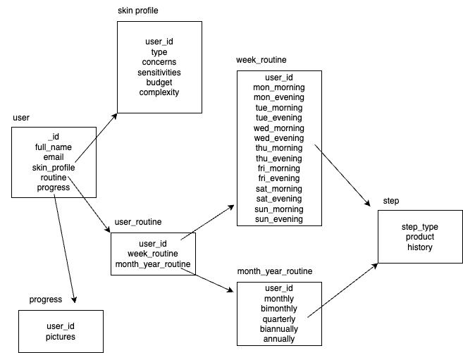

# Design Documentation

All relevant documentation regarding the design and architecture of the app, comprised of flowcharts, wireframes, prototypes and various diagrams.

## Flowcharts

Detailing the user journey through the application for various key interactions.

1. **Sign Up Flow:** Steps for the user to create a profile on the website. [🔗](https://whimsical.com/sign-up-flow-Dsj62kvXbkyziu1p9vuUBp)
2. **Routine Generation Flow:** Steps for the user to get a personalised routine. [🔗](https://whimsical.com/routine-generation-workflow-DTofciNAmszET9qaDHn41y)
3. **Edit Routine Flow:** Steps for the user to edit an existing routine. [🔗](https://whimsical.com/edit-routine-workflow-BtRk3DQgR7hxaxxmShqxwP)

## Wireframes

A wireframe for the first version of the web app, for desktop, tablet and mobile. [🔗](https://whimsical.com/responsive-wireframe-LzsqnavoBDDHDtumGYgdTx)

A wireframe for the second version of the web app, for desktop, tablet and mobile. _Pending_

## Architectural Diagrams

Detailing the various components of the application and their makeup and interactions.

**Database Model Diagram:**

